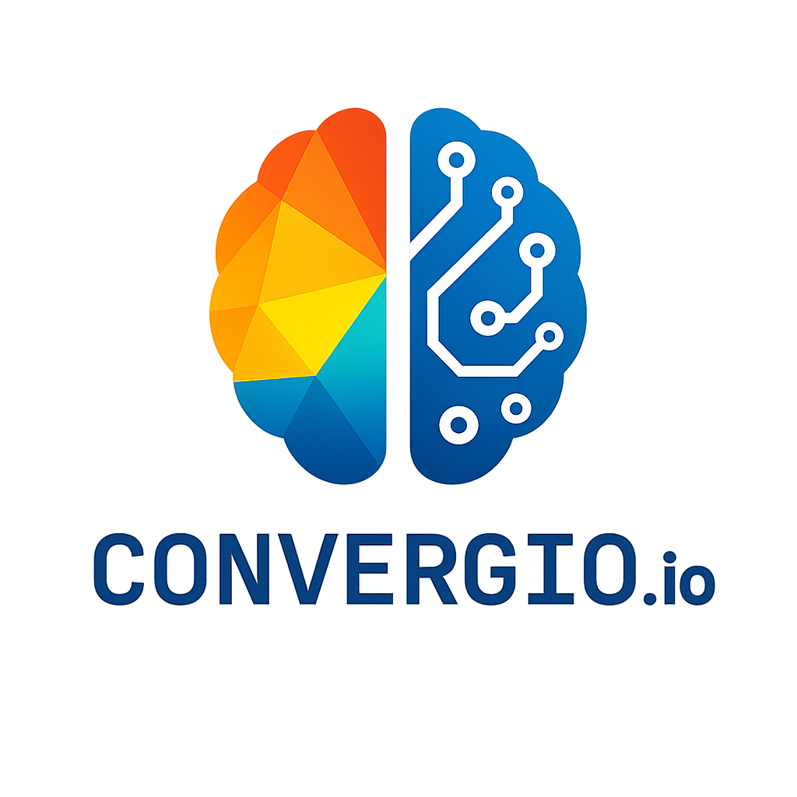

# CONVERGIO.io

*“Convergio is the platform that lets solopreneurs blend human ingenuity with AI so seamlessly, it feels like magic.”*

Convergio is the AI‑first orchestration platform where human ingenuity converges with a coordinated crew of specialized agents. Through intelligent coordination—not just parallel processing—they plan together, execute seamlessly, and explain outcomes across your tools.

## One‑liner

An AI command center for solopreneurs: you set intent, our agent team designs, integrates, and runs your business workflows end‑to‑end—with transparency, safety rails, and accessibility by design.

## Vision & Mission

Convergio’s vision is to empower ambitious solopreneurs to become one‑person unicorns by blending human intent with agent momentum. Our mission is to provide the “business OS” that lets a solo founder orchestrate an army of AI agents and on‑demand experts as if managing a large team.

## Problem

Solo founders drown in tool sprawl and manual glue work. They lose momentum to context switching, repetitive integrations, and decision paralysis. Traditional iPaaS tools wire APIs; single LLM copilots draft text; neither coordinates multidisciplinary execution.

## Solution (Agentic, Outcome‑Driven)

Convergio gives you a virtual company: orchestrated agents with named roles—like Ali (Chief of Staff), Amy (CFO), Baccio (Architect), Sofia (Marketing), Luca (Security)—that collaborate to deliver business outcomes. You speak in goals; they plan, simulate, integrate, and execute across your stack. When a step benefits from human judgment or craft (e.g., brand design, nuanced outreach), Convergio routes the task to vetted, on‑demand freelancers and feeds results back into the same workflow—so AI speed meets human quality. [Upwork](https://www.upwork.com/)

## Market Opportunity (sourced)

- **US nonemployer businesses produce trillion‑dollar output**: The U.S. Census Nonemployer Statistics show nonemployer businesses generated over $1 trillion in annual receipts, underscoring the scale of one‑person firms. [Census NES](https://www.census.gov/programs-surveys/nonemployer-statistics.html)
- **Tens of millions already work independently**: 60M Americans freelanced in the past year (38% of the workforce), contributing $1.27T to the U.S. economy. [Upwork Freelance Forward 2023](https://www.upwork.com/research/freelance-forward-2023)
- **Independent workforce is structurally large and growing**: The U.S. independent workforce remains in the ~70M range with durable growth dynamics. [MBO Partners: State of Independence 2024](https://www.mbopartners.com/state-of-independence/)
- **Gig platforms are scaling**: The freelance platforms market is projected to grow from ~$5.6B (2024) to ~$14.4B by 2030 (17.7% CAGR). [Grand View Research](https://www.grandviewresearch.com/industry-analysis/freelance-platforms-market)
- **Generative AI is the catalyst**: McKinsey estimates genAI could automate up to 60–70% of activities for some roles and add trillions in value, letting very small teams punch far above their weight. [McKinsey (2023)](https://www.mckinsey.com/capabilities/quantumblack/our-insights/the-economic-potential-of-generative-ai-the-next-productivity-frontier)
- **Rapid AI adoption at work**: Knowledge workers are adopting AI at scale. [Microsoft Work Trend Index 2024](https://www.microsoft.com/en-us/worklab/work-trend-index/2024)

Together these signals point to a new class of “AI solopreneurs” who can scale without traditional headcount—precisely where Convergio excels.

## Unique Value Proposition (aligned to “Human intent. Agent momentum.”)

- **True multi‑agent orchestration**: Named specialists (Ali as Chief of Staff, Amy as CFO, Baccio as Architect) collaborate through intelligent coordination—not just parallel execution. The breakthrough is the orchestration layer that enables agents to plan together, delegate appropriately, and deliver cohesive outcomes across disciplines.
- **Human‑in‑the‑loop and human‑on‑demand**: Keep humans in control for judgment calls; route nuanced tasks to on‑demand experts via gig platforms when needed—“the right resource at the right step.”
- **Explainability and provenance by default**: Every plan and action is traceable—“why this, why now”—so you can audit and trust results.
- **Accessibility‑first interface**: Voice, high‑contrast, keyboard navigation, and clear status cues—built from the “For Mario” principles so anyone can operate an AI command center.
- **Safety rails and cost governance**: Guardrails, budget caps, and role isolation let you scale safely.
- **Ecosystem‑ready**: Compatible with emerging multi‑agent and tool standards (e.g., AutoGen‑style orchestration and Anthropic’s Model Context Protocol). [Microsoft AutoGen](https://github.com/microsoft/autogen) · [Anthropic MCP](https://www.anthropic.com/news/model-context-protocol)

Net result: scale without headcount.

## Moat & Defensibility (VC lens)

- **Data network effects**: Workflow telemetry, outcome feedback, and agent critiques build a proprietary corpus to improve planning, routing, and verification for the long tail of solo workflows.
- **Execution graphs as assets**: Versioned “execution graphs” (who/what/why/when) become reusable blueprints; top‑performing graphs can seed a marketplace with reputational moats.
- **Hybrid supply integration**: Native orchestration of AI agents + on‑demand human experts (gig platforms) creates switching costs and lowers failure rates vs AI‑only competitors.
- **Trust rails**: Explainability, cost governance, and accessibility compliance differentiate in regulated and enterprise‑adjacent segments.

## Architecture & Technical Strategy (for engineering leaders)

- **Multi‑agent runtime**: Role‑specialized agents coordinated via a planner/critic loop, with tool adapters (APIs, RPA, webhooks) and memory layers (vector + relational) for context.
- **MCP & tool interoperability**: Adopts Model Context Protocol for secure tool use and agent interoperability; API adapters for CRM, billing, comms, and data warehouses.
- **Determinism where it matters**: Guarded actions, dry‑run simulation, and human approvals for irreversible steps; unit tests for flows; canary runs for new templates.
- **Cost/reliability controls**: Budget caps, retries/backoff, per‑agent SLOs; observability with traces and red‑team prompts to catch regressions.
- **Extensibility**: Open SDK for custom agents/tools; template DSL for shareable blueprints; future marketplace for agents and execution graphs.

## Why We Win (from the Agentic Manifesto)

- **Human accountability**: You keep the decision; agents keep the momentum.
- **Transparent provenance**: Every plan and action is explainable (“why this, why now”).
- **Accessibility‑first**: Designed from the edge—voice, high contrast, keyboard, screen reader.
- **Safety rails before scale**: Guardrails, cost controls, and role isolation are default.
- **Small learning loops**: Ship value early, iterate fast; bias is a bug to detect and fix.

## What You Can Do (real scenarios)

- “Prepare a complete plan for the launch of product ‘Atlas’ in Q4.”  
  Ali assembles the team → PM plans timeline → Amy budgets → Sofia builds the GTM → result: a cohesive, executable plan.
- “Analyze feasibility of launching in Brazil.”  
  Strategy, culture, and sales agents collaborate → market entry report with risks and next steps.
- “I need an investor pitch for my fitness app.”  
  Startup, finance, and storytelling agents co‑create a pitch with projections and narrative.

## Product

- **AI‑Powered Orchestration**: Multi‑agent planning, division of labor, and verification.
- **Visual + Natural Language Builder**: Drag‑and‑drop flows or instruct in plain English.
- **Deep Integrations**: Pre‑built connectors across popular tools; open SDK for more.
- **Real‑time Monitoring & Alerts**: Outcome tracking, cost controls, and anomaly detection.
- **Open Source Core**: Transparent, extensible, community‑driven foundation.

## Accessibility, by Design (built “For Mario”)

Inspired by real accessibility needs, Convergio’s AI‑First Interface prioritizes:

- Voice commands and TTS for hands‑free control
- High‑contrast themes and large, touch‑friendly targets
- Keyboard navigation and screen‑reader semantics
- Gentle animations and clear visual status cues

Accessibility is not an afterthought—it guides every design decision.

## Competitive Landscape

- **Legacy iPaaS**: great at wiring apps, weak at reasoning and cross‑disciplinary execution.
- **LLM copilots/agents**: good at drafting, limited at integrated, multi‑step delivery.
- **Gumloop**: no‑code AI automation (connect data, apps, AI) but primarily AI‑centric; lacks native human talent routing. [gumloop.com](https://www.gumloop.com/)
- **Relay.app**: AI agents + human‑in‑the‑loop approvals for teams; focused on internal collaboration rather than on‑demand external experts for true solo ops. [relay.app](https://www.relay.app/)
- **Convergio**: hybrid AI+human orchestration, explainability, accessibility, and cost governance—purpose‑built for solopreneurs to scale without headcount.

## Why Now

Multi‑agent frameworks (e.g., Microsoft’s AutoGen), interoperable tool standards (e.g., Anthropic’s MCP), falling inference costs, and an explosion of SaaS APIs make outcome‑centric automation finally practical for individuals—not just enterprises.  
[AutoGen](https://github.com/microsoft/autogen) · [Model Context Protocol](https://www.anthropic.com/news/model-context-protocol)

## Business Model

- **Free**: Core orchestration and community connectors
- **Pro**: Advanced agents (finance, security, strategy), premium connectors, higher limits
- **Teams/Enterprise**: Role‑based access, audit trails, SSO, custom SLAs
- **Marketplace**: “AI talent” and connectors marketplace with revenue share

## Go‑to‑Market

- Open‑source distribution and community growth
- Partnerships with agent frameworks and automation communities (incl. AutoGen ecosystem)
- Creator/solopreneur channels: indie hackers, nocode, startup accelerators

## Roadmap

### Now
- Public beta: visual builder, agent orchestrator, core connectors
- AI automation suggestions and explainable plans

### Next
- Deeper multi‑agent verification and simulation loops
- Advanced analytics, cost governance, and reliability SLOs

### Later
- AI talent marketplace (discover, compose, and “hire” agents on demand)
- Mobile experiences and enterprise governance

## The Ask (Hackathons & Investors)

- Looking for pilot partners and early adopters to stress‑test agentic workflows
- Seeking investment and strategic support—especially from the AutoGen community—to accelerate deep multi‑agent orchestration, verification, and marketplace development
- Intros to design partners in creator tooling, ecommerce, and education

## Repo

Contribute or try the beta:
`https://github.com/Convergio/convergio`

## About the Team

Founded by solopreneurs and AI builders, Convergio embodies the Agentic Manifesto: human purpose, AI momentum. We’re building an accessible, explainable future where one person can orchestrate the output of many.

---

Join us—let’s turn intent into momentum.
