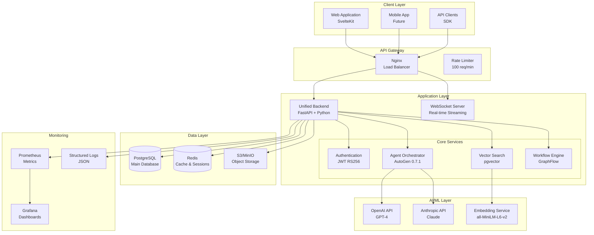

# Convergio Architecture Documentation

## System Overview

Convergio is a unified AI-native business platform that combines talent management, AI agent orchestration, vector search, and real-time analytics in a single, scalable architecture.

## Architecture Diagram



## Component Architecture

### 1. Unified Backend (FastAPI)

The core backend service handles all business logic and API endpoints.

**Technologies**:
- FastAPI (async Python web framework)
- SQLAlchemy 2.0 (ORM with async support)
- Pydantic v2 (data validation)
- Redis (caching and session management)

**Key Features**:
- Async/await throughout
- Connection pooling (20 connections, 30 overflow)
- Request ID tracking
- Structured logging with context

### 2. AI Agent System

Implements AutoGen 0.7.1 for multi-agent orchestration.

**Components**:
- **Agent Loader**: Dynamically loads 41+ agent definitions
- **GroupChat Orchestrator**: Manages multi-agent conversations
- **Memory System**: Redis-backed conversation persistence
- **Security Guardian**: Validates and sanitizes agent actions

**Agent Types**:
- Strategic (C-suite decision makers)
- Technical (architects, engineers)
- Business (sales, marketing, HR)
- Specialized (compliance, security, analytics)

### 3. Vector Search Engine

Semantic search using PostgreSQL with pgvector extension.

**Features**:
- Embedding generation (all-MiniLM-L6-v2)
- Similarity search (cosine distance)
- Hybrid search (keyword + semantic)
- Real-time indexing

### 4. Database Schema

```sql
-- Core Tables
CREATE TABLE users (
    id UUID PRIMARY KEY,
    email VARCHAR(255) UNIQUE NOT NULL,
    created_at TIMESTAMP DEFAULT NOW()
);

CREATE TABLE agents (
    id UUID PRIMARY KEY,
    name VARCHAR(255) NOT NULL,
    definition JSONB,
    status VARCHAR(50),
    created_at TIMESTAMP DEFAULT NOW()
);

CREATE TABLE workflows (
    id UUID PRIMARY KEY,
    name VARCHAR(255),
    configuration JSONB,
    status VARCHAR(50),
    created_at TIMESTAMP DEFAULT NOW()
);

CREATE TABLE audit_logs (
    id UUID PRIMARY KEY,
    user_id UUID REFERENCES users(id),
    action VARCHAR(255),
    details JSONB,
    created_at TIMESTAMP DEFAULT NOW()
);

-- Vector Search
CREATE EXTENSION IF NOT EXISTS vector;

CREATE TABLE embeddings (
    id UUID PRIMARY KEY,
    content TEXT,
    embedding vector(384),
    metadata JSONB,
    created_at TIMESTAMP DEFAULT NOW()
);

CREATE INDEX ON embeddings USING ivfflat (embedding vector_cosine_ops);
```

## Security Architecture

### Authentication & Authorization
- JWT tokens with RS256 algorithm
- Role-based access control (RBAC)
- API key management for service-to-service

### Security Headers
- Content Security Policy (CSP)
- X-Frame-Options: DENY
- X-Content-Type-Options: nosniff
- X-XSS-Protection: 1; mode=block

### Rate Limiting
- Per-endpoint rate limiting
- Sliding window algorithm
- Redis-backed counter storage

### Data Protection
- Encryption at rest (PostgreSQL TDE)
- Encryption in transit (TLS 1.3)
- Sensitive data masking in logs

## Deployment Architecture

### Development
```yaml
services:
  backend:
    image: convergio/backend:latest
    ports:
      - "9000:9000"
    environment:
      - ENVIRONMENT=development
    depends_on:
      - postgres
      - redis
  
  postgres:
    image: postgres:15
    volumes:
      - postgres_data:/var/lib/postgresql/data
  
  redis:
    image: redis:7-alpine
    volumes:
      - redis_data:/data
```

### Production (Kubernetes)
```yaml
apiVersion: apps/v1
kind: Deployment
metadata:
  name: convergio-backend
spec:
  replicas: 3
  selector:
    matchLabels:
      app: convergio-backend
  template:
    metadata:
      labels:
        app: convergio-backend
    spec:
      containers:
      - name: backend
        image: convergio/backend:latest
        ports:
        - containerPort: 9000
        resources:
          requests:
            memory: "512Mi"
            cpu: "500m"
          limits:
            memory: "1Gi"
            cpu: "1000m"
```

## Performance Characteristics

### Benchmarks
- API Response Time: P95 < 200ms
- Concurrent Users: 1000+
- Requests per Second: 500+
- WebSocket Connections: 10,000+

### Optimization Strategies
- Connection pooling
- Redis caching (TTL: 5 minutes)
- Database query optimization
- Lazy loading of agent definitions
- Async I/O throughout

## Monitoring & Observability

### Metrics (Prometheus)
- Request latency histograms
- Error rate counters
- Active connections gauge
- Cache hit rate

### Logging
- Structured JSON logs
- Request ID correlation
- Error stack traces
- Performance timing

### Health Checks
- `/health` - Basic liveness
- `/ready` - Readiness probe
- Database connectivity
- Redis connectivity

## Scaling Strategy

### Horizontal Scaling
- Stateless backend services
- Load balancer (round-robin)
- Shared Redis cache
- Read replicas for PostgreSQL

### Vertical Scaling
- Database connection pooling
- Worker process tuning
- Memory optimization
- Query optimization

## Disaster Recovery

### Backup Strategy
- PostgreSQL: Daily snapshots
- Redis: AOF persistence
- S3: Cross-region replication

### Recovery Objectives
- RPO (Recovery Point Objective): 1 hour
- RTO (Recovery Time Objective): 4 hours

## Future Enhancements

### Planned Features
- GraphQL API layer
- Event sourcing for audit trail
- Multi-tenancy support
- Kubernetes operator
- Service mesh integration

### Technology Upgrades
- Python 3.12+ optimizations
- PostgreSQL 16 features
- Redis 8 compatibility
- AutoGen 1.0 migration