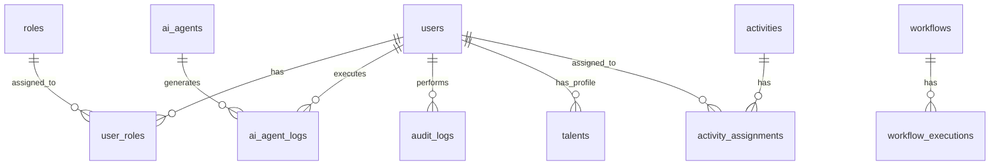

# Convergio Database Schema Documentation

## Overview

Convergio uses PostgreSQL 17.5 as its primary database with pgvector extension for vector search capabilities. The schema is designed for scalability, audit compliance, and multi-tenant support.

## Database Configuration

- **Database**: convergio_db
- **Port**: 5432
- **Connection Pool**: 20 connections (30 overflow)
- **Encoding**: UTF-8
- **Extensions**: pgvector, uuid-ossp

## Core Tables

### Users & Authentication

#### users
Primary user account table.

| Column | Type | Constraints | Description |
|--------|------|------------|-------------|
| id | UUID | PRIMARY KEY | Unique user identifier |
| email | VARCHAR(255) | UNIQUE NOT NULL | User email address |
| password_hash | VARCHAR(255) | NOT NULL | Bcrypt password hash |
| first_name | VARCHAR(100) | | User first name |
| last_name | VARCHAR(100) | | User last name |
| status | VARCHAR(50) | DEFAULT 'active' | Account status |
| created_at | TIMESTAMP | DEFAULT NOW() | Account creation time |
| updated_at | TIMESTAMP | | Last update time |

#### user_roles
User role assignments.

| Column | Type | Constraints | Description |
|--------|------|------------|-------------|
| user_id | UUID | FOREIGN KEY | Reference to users.id |
| role_id | UUID | FOREIGN KEY | Reference to roles.id |
| assigned_at | TIMESTAMP | DEFAULT NOW() | Role assignment time |

### AI Agents

#### ai_agents
AI agent definitions and configurations.

| Column | Type | Constraints | Description |
|--------|------|------------|-------------|
| id | UUID | PRIMARY KEY | Agent identifier |
| name | VARCHAR(255) | NOT NULL | Agent name |
| description | TEXT | | Agent description |
| definition | JSONB | | Agent configuration JSON |
| capabilities | TEXT[] | | Array of capabilities |
| status | VARCHAR(50) | DEFAULT 'active' | Agent status |
| created_at | TIMESTAMP | DEFAULT NOW() | Creation time |

#### ai_agent_logs
Agent execution history.

| Column | Type | Constraints | Description |
|--------|------|------------|-------------|
| id | UUID | PRIMARY KEY | Log entry ID |
| agent_id | UUID | FOREIGN KEY | Reference to ai_agents.id |
| user_id | UUID | FOREIGN KEY | Reference to users.id |
| prompt | TEXT | | Input prompt |
| response | TEXT | | Agent response |
| execution_time_ms | INTEGER | | Execution duration |
| tokens_used | INTEGER | | Token consumption |
| created_at | TIMESTAMP | DEFAULT NOW() | Execution time |

### Workflows

#### workflows
Workflow definitions.

| Column | Type | Constraints | Description |
|--------|------|------------|-------------|
| id | UUID | PRIMARY KEY | Workflow ID |
| name | VARCHAR(255) | NOT NULL | Workflow name |
| description | TEXT | | Description |
| configuration | JSONB | | Workflow configuration |
| status | VARCHAR(50) | DEFAULT 'active' | Workflow status |
| created_by | UUID | FOREIGN KEY | Creator user ID |
| created_at | TIMESTAMP | DEFAULT NOW() | Creation time |

#### workflow_executions
Workflow execution history.

| Column | Type | Constraints | Description |
|--------|------|------------|-------------|
| id | UUID | PRIMARY KEY | Execution ID |
| workflow_id | UUID | FOREIGN KEY | Reference to workflows.id |
| status | VARCHAR(50) | | Execution status |
| input_data | JSONB | | Input parameters |
| output_data | JSONB | | Execution results |
| started_at | TIMESTAMP | | Start time |
| completed_at | TIMESTAMP | | Completion time |

### Talent Management

#### talents
Talent/resource profiles.

| Column | Type | Constraints | Description |
|--------|------|------------|-------------|
| id | UUID | PRIMARY KEY | Talent ID |
| user_id | UUID | FOREIGN KEY | Associated user |
| skills | TEXT[] | | Skill array |
| experience_years | INTEGER | | Years of experience |
| availability | VARCHAR(50) | | Availability status |
| rate | DECIMAL(10,2) | | Hourly rate |
| created_at | TIMESTAMP | DEFAULT NOW() | Profile creation |

### Activities & Projects

#### activities
Activity/project tracking.

| Column | Type | Constraints | Description |
|--------|------|------------|-------------|
| id | UUID | PRIMARY KEY | Activity ID |
| name | VARCHAR(255) | NOT NULL | Activity name |
| description | TEXT | | Description |
| type_id | UUID | FOREIGN KEY | Activity type |
| status_id | UUID | FOREIGN KEY | Activity status |
| start_date | DATE | | Start date |
| end_date | DATE | | End date |
| created_at | TIMESTAMP | DEFAULT NOW() | Creation time |

#### activity_assignments
Resource assignments to activities.

| Column | Type | Constraints | Description |
|--------|------|------------|-------------|
| id | UUID | PRIMARY KEY | Assignment ID |
| activity_id | UUID | FOREIGN KEY | Reference to activities.id |
| user_id | UUID | FOREIGN KEY | Assigned user |
| role | VARCHAR(100) | | Assignment role |
| assigned_at | TIMESTAMP | DEFAULT NOW() | Assignment time |

### Audit & Compliance

#### audit_logs
Comprehensive audit trail.

| Column | Type | Constraints | Description |
|--------|------|------------|-------------|
| id | UUID | PRIMARY KEY | Log entry ID |
| user_id | UUID | FOREIGN KEY | Acting user |
| action | VARCHAR(255) | NOT NULL | Action performed |
| entity_type | VARCHAR(100) | | Entity type affected |
| entity_id | UUID | | Entity ID affected |
| details | JSONB | | Additional details |
| ip_address | INET | | Client IP address |
| user_agent | TEXT | | Client user agent |
| created_at | TIMESTAMP | DEFAULT NOW() | Action timestamp |

**Indexes**:
- `idx_audit_logs_user_id` ON user_id
- `idx_audit_logs_created_at` ON created_at DESC
- `idx_audit_logs_entity_type_id` ON (entity_type, entity_id)

### Vector Search

#### embeddings
Vector embeddings for semantic search.

| Column | Type | Constraints | Description |
|--------|------|------------|-------------|
| id | UUID | PRIMARY KEY | Embedding ID |
| content | TEXT | NOT NULL | Original content |
| embedding | vector(384) | NOT NULL | Vector embedding |
| metadata | JSONB | | Additional metadata |
| created_at | TIMESTAMP | DEFAULT NOW() | Creation time |

**Indexes**:
- `idx_embeddings_vector` ON embedding USING ivfflat (embedding vector_cosine_ops)

### Cost Management

#### cost_tracking
Cost and usage tracking.

| Column | Type | Constraints | Description |
|--------|------|------------|-------------|
| id | UUID | PRIMARY KEY | Record ID |
| user_id | UUID | FOREIGN KEY | User reference |
| service | VARCHAR(100) | | Service name |
| amount | DECIMAL(10,4) | | Cost amount |
| currency | VARCHAR(3) | DEFAULT 'USD' | Currency code |
| usage_data | JSONB | | Usage details |
| date | DATE | | Usage date |
| created_at | TIMESTAMP | DEFAULT NOW() | Record time |

## Relationships



## Optimizations

### Indexes
All foreign keys have indexes for join performance. Additional indexes on:
- Email addresses for authentication
- Timestamps for time-based queries
- Status fields for filtering
- JSONB fields using GIN indexes

### Partitioning
- `audit_logs` partitioned by month
- `ai_agent_logs` partitioned by month
- `cost_tracking` partitioned by quarter

### Performance Tuning
```sql
-- Connection pooling
max_connections = 200
shared_buffers = 256MB
effective_cache_size = 1GB
work_mem = 4MB

-- Write performance
checkpoint_segments = 32
checkpoint_completion_target = 0.9

-- Query optimization
random_page_cost = 1.1  -- For SSD storage
```

## Migration Strategy

### Version Control
All schema changes managed through migration files:
- Location: `/migrations/`
- Naming: `V{version}_{description}.sql`
- Tool: Alembic or Flyway

### Backup Policy
- Full backup: Daily at 2 AM UTC
- Incremental: Every 6 hours
- Retention: 30 days
- Point-in-time recovery: Enabled

## Security Considerations

### Data Protection
- Sensitive fields encrypted at rest
- PII data masked in logs
- Row-level security for multi-tenancy
- Column-level encryption for sensitive data

### Access Control
```sql
-- Read-only role for analytics
CREATE ROLE analytics_reader;
GRANT SELECT ON ALL TABLES IN SCHEMA public TO analytics_reader;

-- Application role
CREATE ROLE app_user;
GRANT SELECT, INSERT, UPDATE, DELETE ON ALL TABLES IN SCHEMA public TO app_user;
```

## Maintenance

### Regular Tasks
```sql
-- Daily VACUUM ANALYZE
VACUUM ANALYZE;

-- Weekly reindex
REINDEX DATABASE convergio_db;

-- Monthly cleanup old logs
DELETE FROM audit_logs WHERE created_at < NOW() - INTERVAL '90 days';
```

### Monitoring Queries
```sql
-- Table sizes
SELECT 
    tablename,
    pg_size_pretty(pg_total_relation_size(tablename::regclass)) AS size
FROM pg_tables
WHERE schemaname = 'public'
ORDER BY pg_total_relation_size(tablename::regclass) DESC;

-- Slow queries
SELECT 
    query,
    calls,
    mean_exec_time
FROM pg_stat_statements
WHERE mean_exec_time > 100
ORDER BY mean_exec_time DESC
LIMIT 10;
```