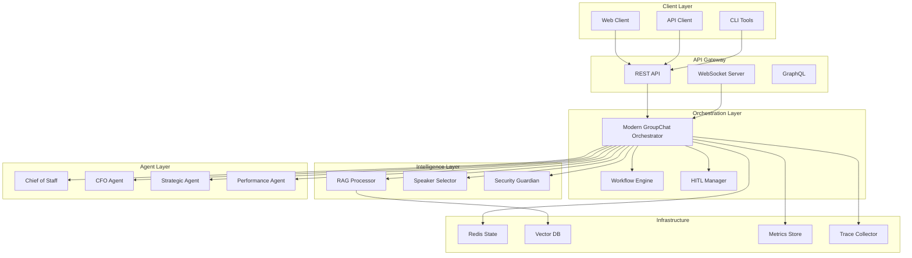
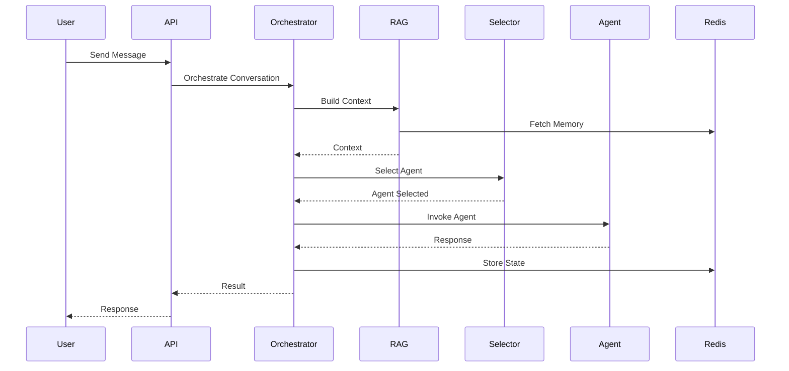
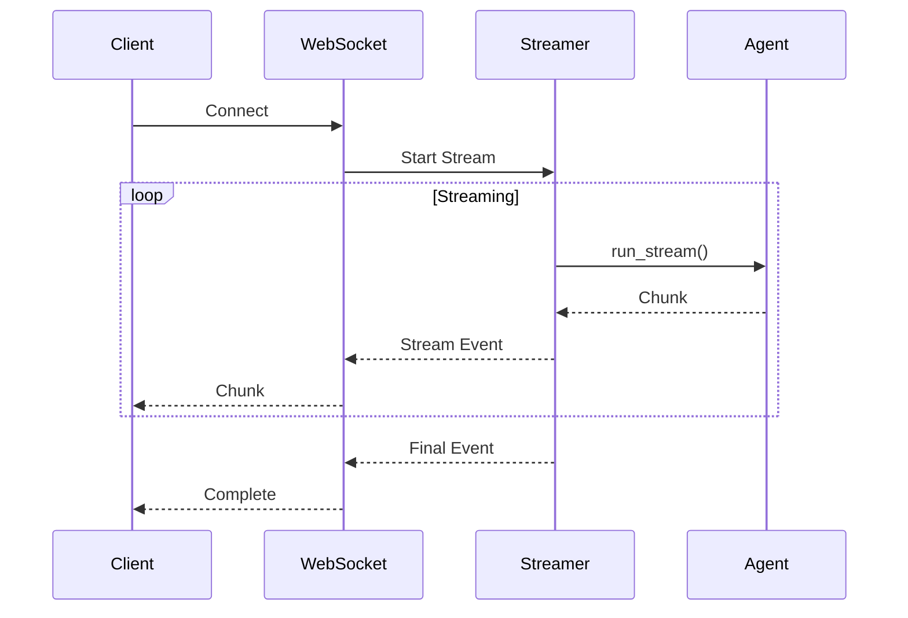

# Convergio AutoGen Architecture

## Overview

The Convergio AutoGen system implements Microsoft's AutoGen framework with enterprise-grade enhancements for production deployment. This document describes the complete architecture, components, and design decisions.

## System Architecture



## Core Components

### 1. Modern GroupChat Orchestrator

The central orchestration engine that manages multi-agent conversations using AutoGen's GroupChat pattern.

**Location**: `backend/src/agents/services/autogen_groupchat_orchestrator.py`

**Key Features**:
- Native AutoGen GroupChat integration
- Dynamic agent loading and initialization
- Cost tracking and budget enforcement
- HITL approval workflows
- Security validation
- Memory-augmented responses

**Architecture Decisions**:
- Uses `SelectorGroupChat` for intelligent agent routing
- Implements conversation state management via Redis
- Supports both synchronous and streaming responses
- Integrates observability at every interaction point

### 2. RAG (Retrieval Augmented Generation) System

Advanced RAG processor with multi-factor scoring and memory integration.

**Location**: `backend/src/agents/services/groupchat/rag.py`

**Key Features**:
- Multi-factor scoring (relevance, importance, recency)
- Semantic similarity using embeddings
- Conversation history integration
- Knowledge base queries
- Dynamic context building

**Scoring Algorithm**:
```python
final_score = (
    relevance_score * relevance_weight +
    importance_score * importance_weight +
    recency_score * recency_weight
)
```

### 3. Intelligent Speaker Selection

Multi-dimensional agent selection system based on expertise, mission phase, and performance.

**Location**: `backend/src/agents/services/groupchat/selection_policy.py`

**Selection Factors**:
- **Expertise Domains**: Strategy, Finance, Operations, Security, etc.
- **Mission Phases**: Discovery, Analysis, Strategy, Execution, Monitoring
- **Performance History**: Response quality, speed, success rate
- **Collaboration Patterns**: Agent synergies and dependencies
- **Urgency Handling**: Fast-response agent prioritization

**Composite Scoring**:
```python
composite_score = (
    expertise_score * 0.25 +
    phase_relevance * 0.20 +
    complexity_handling * 0.15 +
    collaboration_score * 0.15 +
    performance_score * 0.10 +
    recency_score * 0.10 +
    urgency_score * 0.05
)
```

### 4. Native Streaming System

True AutoGen streaming implementation without simulation.

**Location**: `backend/src/agents/services/streaming/runner.py`

**Features**:
- Native `agent.run_stream()` integration
- Event type detection and handling
- Backpressure control
- Heartbeat management
- Tool call streaming

**Event Types**:
- TextMessage streaming
- HandoffMessage for agent transfers
- ToolCallMessage for function execution
- ToolResultMessage for results
- Error and status events

### 5. GraphFlow Workflow Engine

Business process automation with pre-defined workflow templates.

**Location**: `backend/src/agents/services/graphflow/`

**Workflow Types**:
1. **Strategic Analysis**: Market analysis → Financial assessment → Strategic synthesis
2. **Product Launch**: Validation → GTM Strategy → Financial Planning → Execution
3. **Market Entry**: Research → Entry Strategy → Risk Assessment → Implementation

**Workflow Features**:
- Step dependencies and parallel execution
- Approval gates and quality checks
- SLA monitoring
- Success metrics tracking
- Failure handling and escalation

### 6. Cost & Safety System

Comprehensive cost tracking with per-turn granularity and budget enforcement.

**Location**: `backend/src/agents/services/cost_tracker.py`

**Features**:
- Per-turn cost callbacks
- Multi-level budget controls (turn, conversation, daily)
- Efficiency scoring
- Cost trend analysis
- Model optimization recommendations
- Real-time budget breach detection

**Budget Hierarchy**:
```
Daily Limit ($50)
  └── Conversation Limit ($5)
      └── Turn Spike Detection (10% of daily)
```

### 7. HITL (Human-in-the-Loop) System

Approval workflows for critical operations.

**Location**: `backend/src/agents/services/hitl/approval_store.py`

**Workflow**:
1. Request approval with metadata
2. Queue for human review
3. Grant/Deny with comments
4. Callback to resume/cancel operation

**Use Cases**:
- High-cost operations
- Sensitive data access
- Critical workflow execution
- Production deployments

### 8. Security Guardian

AI-powered security validation and threat detection.

**Location**: `backend/src/agents/security/ai_security_guardian.py`

**Security Checks**:
- Prompt injection detection
- Data exfiltration attempts
- Malicious pattern recognition
- Rate limiting enforcement
- User authorization validation

### 9. Observability System

Complete observability with OpenTelemetry integration.

**Location**: `backend/src/agents/services/observability/`

**Components**:
- **Distributed Tracing**: Request flow visualization
- **Metrics Collection**: Performance and business metrics
- **Structured Logging**: Contextual log aggregation
- **Alert Management**: Threshold-based alerting
- **Health Monitoring**: System health dashboards

**Key Metrics**:
- Conversation duration (P50, P95, P99)
- Agent response times
- Cost per turn
- Token usage
- Error rates
- Queue depths
- Memory usage

## Data Flow

### 1. Conversation Flow



### 2. Streaming Flow



## Deployment Architecture

### Production Setup

```yaml
services:
  api:
    replicas: 3
    resources:
      cpu: 2
      memory: 4Gi
    
  orchestrator:
    replicas: 2
    resources:
      cpu: 4
      memory: 8Gi
    
  redis:
    mode: cluster
    nodes: 3
    persistence: true
    
  vector_db:
    type: pgvector
    replicas: 2
    
  observability:
    jaeger: enabled
    prometheus: enabled
    grafana: enabled
```

### Scaling Considerations

1. **Horizontal Scaling**: Orchestrator instances can scale horizontally with Redis-based state sharing
2. **Agent Pool Management**: Dynamic agent loading based on demand
3. **Cost Optimization**: Automatic model selection based on query complexity
4. **Cache Strategy**: Multi-level caching for embeddings and responses
5. **Queue Management**: Backpressure control for streaming operations

## Security Architecture

### Defense in Depth

1. **API Gateway**: Rate limiting, authentication, authorization
2. **Prompt Validation**: AI Security Guardian pre-screening
3. **Data Isolation**: User-specific memory namespaces
4. **Audit Logging**: Complete interaction history
5. **Encryption**: TLS in transit, AES-256 at rest

### Compliance

- GDPR-compliant data handling
- SOC2 audit trail
- HIPAA-ready infrastructure
- PCI DSS for payment processing

## Performance Optimization

### Optimization Strategies

1. **Smart Caching**
   - Embedding cache with TTL
   - Response cache for common queries
   - Agent metadata caching

2. **Batch Processing**
   - Bulk embedding generation
   - Parallel agent invocations
   - Batch cost calculations

3. **Resource Management**
   - Connection pooling
   - Memory-mapped vector indices
   - Lazy agent initialization

### Performance Targets

- **Response Time**: P95 < 2s
- **Streaming Latency**: < 100ms per chunk
- **Throughput**: 1000 conversations/minute
- **Availability**: 99.95% uptime

## Extension Points

### Adding New Agents

1. Create agent definition in `agents/definitions/`
2. Implement agent class extending `AssistantAgent`
3. Register in agent loader
4. Add capability profile in selection policy

### Custom Workflows

1. Define workflow in GraphFlow format
2. Add to workflow registry
3. Implement step handlers
4. Configure approval gates

### Custom Tools

1. Implement tool function
2. Add to agent tool registry
3. Configure tool permissions
4. Add observability hooks

## Best Practices

### Development

1. **Type Safety**: Use Pydantic models for all data structures
2. **Error Handling**: Implement circuit breakers for external services
3. **Testing**: Minimum 80% test coverage
4. **Documentation**: Inline comments and docstrings

### Operations

1. **Monitoring**: Alert on SLI breaches
2. **Capacity Planning**: Regular load testing
3. **Incident Response**: Runbooks for common issues
4. **Cost Management**: Daily budget reviews

## Troubleshooting

### Common Issues

1. **High Latency**
   - Check agent response times
   - Verify Redis performance
   - Review embedding cache hit rate

2. **Budget Exceeded**
   - Review per-turn costs
   - Check model selection
   - Analyze conversation lengths

3. **Agent Selection Issues**
   - Verify capability profiles
   - Check selection weights
   - Review mission phase detection

## References

- [Microsoft AutoGen Documentation](https://microsoft.github.io/autogen/)
- [OpenTelemetry Specification](https://opentelemetry.io/docs/)
- [Redis Best Practices](https://redis.io/docs/manual/patterns/)
- [Vector Database Comparison](https://github.com/erikbern/ann-benchmarks)